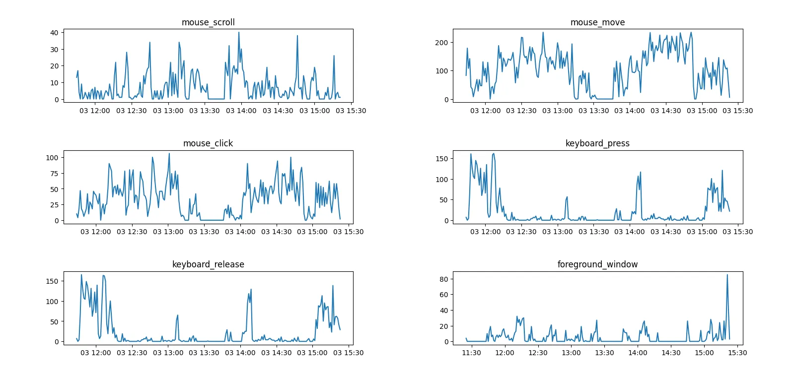
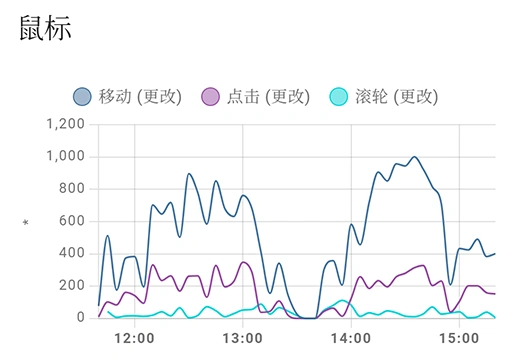

# 抗催眠装置！

这几天总感觉有点晕糊糊的，头脑不是很清晰，打牌的时候也经常出昏招。于是我就想，可能是有催眠大叔在偷偷催眠我！

但是被催眠的人是察觉不到自己的异常的。好在聪明的莉沫酱想到，可以发明1个程序用来自动记录下自己的行为，这样就可以分析出自己是不是被催眠啦！

好，就叫「抗催眠装置」吧！

## 效果

抗催眠装置运行之后，就会开始记录你在电脑上的操作，包括以下内容: 

- 鼠标: 移动，点击，滚动。
- 键盘: 键按下和弹起。
- 窗口: 活动窗口的位置、大小、标题、文件路径。

这些数据会每小时存储1份到你的用户目录(`C:\Users\用户名\.negate-hypnotic`)下，然后就可以用这些数据慢慢分析啦！

自动检测异常的部分还没写，有什么好办法呢……

## 使用方法

首先你需要1个Python3。

然后用pip安装:

`pip install git+https://github.com/RimoChan/negate_hypnotic.git`。

直接运行就可以啦:

`python -m negate_hypnotic`

如果你想要开机启动，就建1个快捷方式，目标是`pythonw.exe -m negate_hypnotic`，然后把快捷方式放到你的开机启动项里就可以了。

## 数据显示

如果你想要看看自己前几天都做了什么事，可以运行`python -m negate_hypnotic.show -n 回溯的小时数`。这个命令会根据你前几天的干的好事，用matplotlib绘制1张图，像是这样: 

此外，运行时也会自动启动1个prometheus client，会在2333端口提供1个统计服务，用于接入Grafana之类的实时显示折线图的系统使用，像是这样: 

等下，我突然发现13:30的时候鼠标不动了，说明可能是催眠ojisan出现了！

## 结束

就这样，我要去和催眠ojisan决1死战了，大家88！
